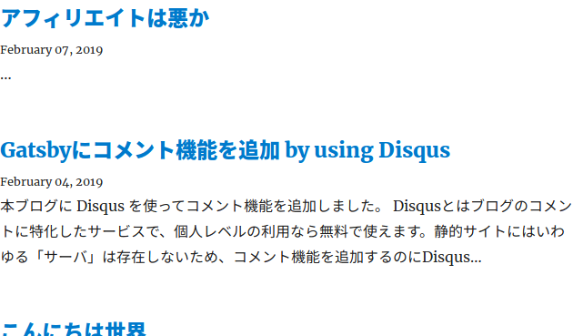

## TL;DR

[GatsbyJS: Excerpts for non-latin languages](https://www.gatsbyjs.org/packages/gatsby-transformer-remark/#excerpts-for-non-latin-languages)
```graphql
{
  markdownRemark {
    excerpt(truncate: true)
  }
}
```

## きっかけ

Gatsbyでブログを作成しましたが、３投稿目にして記事の抜粋が表示されない問題が発生しました。



いろいろ試してみたところ、どうやら抜粋は大文字英単語で終わることがわかってきました。
なので、多分日本語由来の問題ではないかと思い調べてたところ解決策を見つけました。

## 解決策

GatsbyでMarkdownを扱うgatsby-transformer-remarkは、デフォルトで`underscore.string/prune`を用いて抜粋をつくっているそうです。
しかし、これは非ラテン文字を扱えないため、日本語を用いる場合は変更する必要があります。

gatsby-starter-blogを使っている場合は、`src/pages/index.js`を次のように変更することで変更できます。

```diff
@@ -54,7 +54,7 @@ export const pageQuery = graphql`
     allMarkdownRemark(sort: { fields: [frontmatter___date], order: DESC }) {
       edges {
         node {
-          excerpt(truncate: true)
+          excerpt
           fields {
             slug
           }

```
